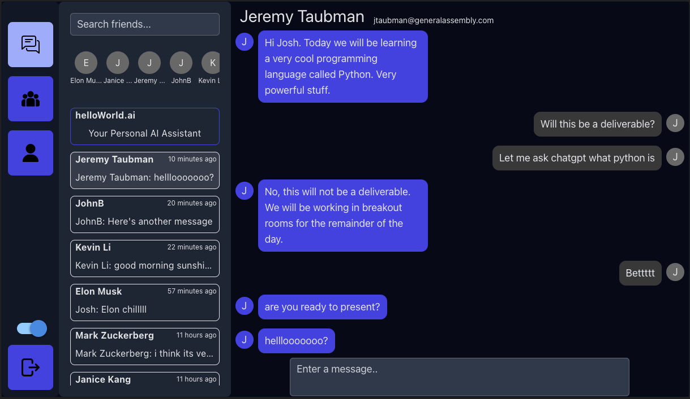

# helloWorld

## A Smarter way to Chat.

#### Josh Matthew | Theresa Kennelly | John Brooks | Kevin Li

[helloWorld](https://helloworldfrontend-production.up.railway.app/login)

[helloWorld-backend](https://github.com/kevinleet/helloWorld_backend)

helloWorld is a real-time chat application that leverages the power of AI to enhance user conversations. It provides an intuitive and seamless chatting experience with the added benefit of AI-generated responses. Whether you want to have a casual chat, seek assistance, or simply explore the capabilities of artificial intelligence, helloWorld is here to make your conversations more engaging and interactive.

The goal of this project was to work together to build a full-stack collaberative app. Our goal was to make a real-time chat app that intergrates AI within personal private messages with peers. In the future, we would like to fix small bugs to make the user expirience more streamline, and fully intergrate AI into the app's capabilities. 

## Features

### Real-Time Chatting:
Connect with friends, colleagues, or new acquaintances instantly using helloWorld's real-time chat functionality. Experience smooth and responsive communication with minimal latency.

### AI-Powered Responses (currently in development): 
helloWorld integrates cutting-edge AI technology to provide automated responses that adapt to the context of the conversation. Choose at any time to respond to you colleague's messages with an AI Generated Response! Enjoy dynamic and intelligent interactions, making your chats more interesting and interactive.

### User-Friendly Interface: 
helloWorld boasts a clean and intuitive user interface, designed to provide a seamless chatting experience. The straightforward layout allows users to focus on their conversations without any distractions.

### Privacy and Security: 
Your privacy and security are of utmost importance. helloWorld ensures that all your login information is securely stored. Rest assured that your data is protected throughout your chat experience.

## Tech

- JS: Used in the backend to create API and dataBase functionality and communication with the frontend.
- React: Used to build the frontend and create a enjoyable user expirience.
- tailwindCSS: Used within the frontend ReactApp for cohesive and easy-to-edit styling.
- Railway: Used to deploy final project.

## Wireframe, ERD and CHD

[TrelloBoard](https://trello.com/b/ARG2PWMG/helloworld)

## Contributions
### Josh Matthew
[Linkedin](https://www.linkedin.com/in/joshua-mathew41/)
[GitHub](https://github.com/jsm4228)

### Theresa Kennelly
[Linkedin](https://www.linkedin.com/in/theresa-kennelly/)
[GitHub](https://github.com/tkennelly)

### John Brooks
[Linkedin](https://www.linkedin.com/in/johnbrooks-webdev/)
[GitHub](https://github.com/quark934)

### Kevin Li
[Linkedin](https://www.linkedin.com/in/kevinli617)
[GitHub](https://github.com/kevinleet)
